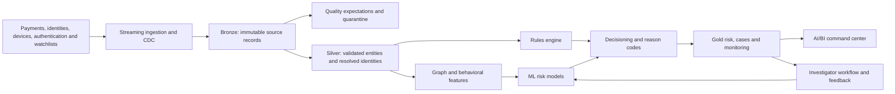

# AegisPay Financial Crime Intelligence Platform

AegisPay is a production-oriented Databricks reference platform for detecting payment fraud, account takeover, money-laundering patterns, and coordinated criminal networks. It converts streaming payment and identity activity into governed, explainable, investigation-ready decisions.

## Business problem

Financial institutions must identify suspicious activity quickly without overwhelming investigators with false positives. A useful solution must do more than produce a score: it must ingest changing data reliably, connect related identities, protect sensitive information, explain each decision, support human investigation, and remain testable and deployable.

## Target capabilities

- Streaming payment ingestion and change data capture
- Lakeflow Declarative Pipelines using Bronze, Silver, and Gold layers
- Data contracts, quality expectations, reconciliation, and quarantine
- Customer 360 identity resolution and graph-derived network features
- Rules, behavioral analytics, and ML-based financial-crime detection
- Explainable decisions with evidence and reason codes
- Investigation queues and analyst-feedback loops
- MLflow experiment tracking, model registration, evaluation, and monitoring
- Unity Catalog governance, masking, row filters, lineage, and auditability
- AI/BI dashboards for executives, operations, investigators, and model risk
- Databricks Asset Bundle delivery across development, staging, and production
- Automated tests and GitHub Actions quality gates

## Architecture

## Success measures

The demonstration will report fraud recall, false-positive rate, precision at investigator capacity, decision latency, data-quality pass rate, reconciliation accuracy, pipeline recovery, model drift, and cost per processed event. Synthetic data is used throughout; no real personal or financial information is included.

## Repository map

| Path | Purpose |
|---|---|
| `docs/` | Business case, architecture, threat model, and technical decisions |
| `resources/` | Databricks bundle resources |
| `src/aegispay/` | Reusable Python modules |
| `src/pipelines/` | Lakeflow pipeline source |
| `src/notebooks/` | Demonstration and operational notebooks |
| `tests/` | Unit, contract, and configuration tests |
| `.github/workflows/` | Continuous-integration quality gates |

## Delivery roadmap

1. Foundation, business case, threat model, and architecture
2. Synthetic financial-event generator and data contracts
3. Streaming ingestion, CDC, medallion transformations, and quarantine
4. Identity resolution, graph features, and multi-layer detection
5. MLflow lifecycle, explainability, cases, and analyst feedback
6. Governance, monitoring, dashboards, CI/CD, and recovery demonstrations

## Interview summary

> I designed AegisPay as an end-to-end financial-crime decisioning platform rather than a standalone fraud model. It combines reliable streaming data engineering, identity and network analytics, explainable rules and machine learning, governed investigator workflows, monitoring, and controlled multi-environment deployment on Databricks.

## Data contracts and synthetic scenarios

Versioned JSON contracts define payments, customer CDC changes, authentication activity, device/IP intelligence, and employee or service access events. The deterministic generator in `src/aegispay/synthetic.py` creates privacy-safe labeled scenarios for legitimate activity, payment fraud, account takeover, brute force, impossible travel, anonymized networks, mule networks, layering, privileged-access abuse, and anomalous bulk data access. These labels exist for engineering validation and must not be presented as real-world model results.

## Status

- Milestone 1 — platform foundation and design: complete
- Milestone 2 — data contracts and synthetic financial events: complete in DEV
- Milestone 3 — Bronze streaming ingestion, expectations, quarantine, and customer AUTO CDC: implemented
- Milestone 4 — Silver deduplication, conformed identities, and transaction-network edges: implemented
- Milestone 5A — authentication, device/IP, and access telemetry contracts and Bronze ingestion: implemented
- Milestone 5B — behavioral, geographic, anonymized-network, and privileged-access risk features with reason codes: implemented
- Milestone 5C — Gold explainable transaction decisions, investigation queue, access alerts, and operational metrics: implemented
