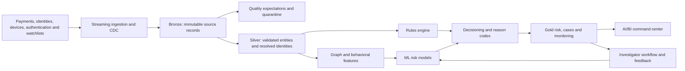

# AegisPay Financial Crime Intelligence Platform

**Databricks Lakehouse · Lakeflow · Unity Catalog · MLflow · AI/BI · Python · GitHub Actions**

AegisPay is a production-oriented Databricks reference platform for detecting payment fraud, account takeover, money-laundering patterns, and coordinated criminal networks. It converts payment, identity, authentication, device, and access activity into governed, explainable, investigation-ready decisions. All records and labels are synthetic.

## Demonstrated results

The complete DEV flow was deployed and exercised in Databricks before the trial
workspace credits expired. Verified outputs included:

| Outcome | Verified result |
|---|---:|
| Scored transactions | 1,000 |
| Critical ML-risk transactions | 198 |
| Gold investigation cases | 383 |
| Privileged-access alerts | 2 |
| Average model fraud probability | 20.47% |
| Model-policy action agreement | 42.30% |
| Registered model | `workspace.aegispay_dev.aegispay_fraud_risk_model` Version 1, `Champion` |
| Dashboard | Four-page AegisPay Financial Crime Command Center |
| Automated quality gate | 28 tests plus Python compilation and YAML validation |

Perfect synthetic evaluation scores validate the mechanics of the ML lifecycle;
they are not presented as estimates of real-world fraud performance.

## Five-minute review path

1. Read the [architecture](docs/architecture.md) and inspect the diagram below.
2. Review the Bronze, Silver, and Gold implementations in `src/pipelines/`.
3. Follow the [demonstration walkthrough](docs/demo-walkthrough.md).
4. Inspect ML training, governed scoring, and operational controls in
   `src/notebooks/02_train_fraud_model.py` through
   `src/notebooks/05_validate_operational_health.py`.
5. Review the [operations runbook](docs/operations-runbook.md),
   [threat model](docs/threat-model.md), and
   [interview guide](docs/interview-guide.md).

## Business problem

Financial institutions must identify suspicious activity quickly without overwhelming investigators with false positives. A useful solution must do more than produce a score: it must ingest changing data reliably, connect related identities, protect sensitive information, explain each decision, support human investigation, and remain testable and deployable.

## Target capabilities

- Streaming payment ingestion and change data capture
- Lakeflow Declarative Pipelines using Bronze, Silver, and Gold layers
- Data contracts, quality expectations, reconciliation, and quarantine
- Customer 360 identity resolution and graph-derived network features
- Rules, behavioral analytics, and ML-based financial-crime detection
- Explainable decisions with evidence and reason codes
- Investigation queues and analyst-feedback loops
- MLflow experiment tracking, model registration, evaluation, and monitoring
- Unity Catalog governance, protected views, lineage, and auditability
- AI/BI dashboards for executives, operations, investigators, and model risk
- Databricks Asset Bundle delivery across development, staging, and production
- Automated tests and GitHub Actions quality gates

## Architecture

## Success measures

The demonstration will report fraud recall, false-positive rate, precision at investigator capacity, decision latency, data-quality pass rate, reconciliation accuracy, pipeline recovery, model drift, and cost per processed event. Synthetic data is used throughout; no real personal or financial information is included.

## Repository map

| Path | Purpose |
|---|---|
| `docs/` | Business case, architecture, threat model, and technical decisions |
| `resources/` | Databricks bundle resources |
| `src/aegispay/` | Reusable Python modules |
| `src/pipelines/` | Lakeflow pipeline source |
| `src/notebooks/` | Demonstration and operational notebooks |
| `tests/` | Unit, contract, and configuration tests |
| `.github/workflows/` | Continuous-integration quality gates |

## Delivery roadmap

1. Foundation, business case, threat model, and architecture
2. Synthetic financial-event generator and data contracts
3. Streaming ingestion, CDC, medallion transformations, and quarantine
4. Identity resolution, graph features, and multi-layer detection
5. MLflow lifecycle, explainability, cases, and analyst feedback
6. Governance, monitoring, dashboards, CI/CD, and recovery demonstrations

## Interview summary

> I designed AegisPay as an end-to-end financial-crime decisioning platform rather than a standalone fraud model. It combines reliable streaming data engineering, identity and network analytics, explainable rules and machine learning, governed investigator workflows, monitoring, and controlled multi-environment deployment on Databricks.

## Data contracts and synthetic scenarios

Versioned JSON contracts define payments, customer CDC changes, authentication activity, device/IP intelligence, and employee or service access events. The deterministic generator in `src/aegispay/synthetic.py` creates privacy-safe labeled scenarios for legitimate activity, payment fraud, account takeover, brute force, impossible travel, anonymized networks, mule networks, layering, privileged-access abuse, and anomalous bulk data access. These labels exist for engineering validation and must not be presented as real-world model results.

## Delivery status

| Capability | Evidence status |
|---|---|
| Foundation, threat model, contracts, and synthetic generators | Deployed and verified in DEV |
| Bronze ingestion, expectations, quarantine, and customer AUTO CDC | Deployed and verified in DEV |
| Silver conformance, identity, behavioral, geographic, and graph features | Deployed and verified in DEV |
| Gold decisions, reason codes, cases, access alerts, and metrics | Deployed and verified in DEV |
| Four-page AI/BI Financial Crime Command Center | Published and verified in DEV |
| MLflow training, evaluation, model registration, and `Champion` alias | Deployed and verified in DEV |
| Governed scoring, policy comparison, feedback tables, and protected view | Deployed and verified in DEV |
| Paused schedule, operational health gates, and recovery runbook | Source complete and GitHub CI-verified; Databricks deployment pending renewed workspace access |

The repository intentionally distinguishes deployed evidence from source-only
work. No claim depends on unavailable production data or an active paid workspace.
